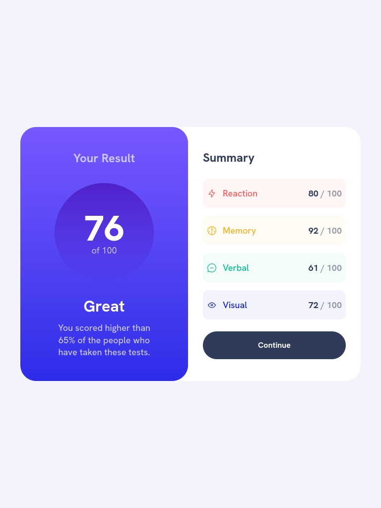
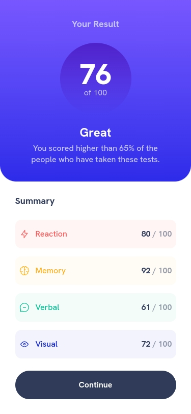
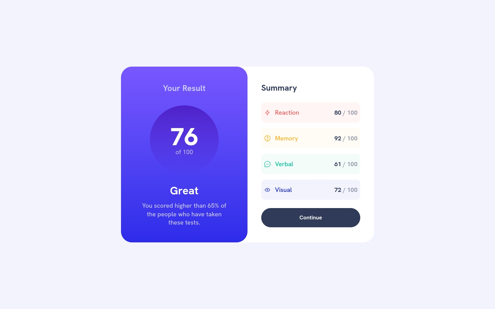

# Frontend Mentor - Results summary component solution

This is a solution to the [Results summary component challenge on Frontend Mentor](https://www.frontendmentor.io/challenges/results-summary-component-CE_K6s0maV). Frontend Mentor challenges help you improve your coding skills by building realistic projects. 

## Table of contents

- [Overview](#overview)
  - [The challenge](#the-challenge)
  - [Screenshot](#screenshot)
  - [Links](#links)
- [My process](#my-process)
  - [Built with](#built-with)
  - [What I learned](#what-i-learned)
- [Author](#author)

## Overview

### The challenge

Users should be able to:

- View the optimal layout for the interface depending on their device's screen size
- See hover and focus states for all interactive elements on the page
- **Bonus**: Use the local JSON data to dynamically populate the content

### Screenshot

### Links

- Solution URL: [Add solution URL here](https://your-solution-url.com)
- Live Site URL: [Add live site URL here](https://your-live-site-url.com)

## My process

Root component that layouts the main structure with grid system.

Displays the overall result score and summary message.

Shows detailed breakdown of scores by category with color-coded indicators.

Custom hook that fetches and manages data from the JSON file.

### Built with

- Semantic HTML5 markup
- CSS custom properties
- Flexbox
- CSS Grid
- Mobile-first workflow
- [React](https://reactjs.org/) - JS library
- [Tailwind](https://tailwindcss.com/)

### What I learned

Custom hook that fetches and manages data from the JSON file.
export function useDataJson() {
    const [jsonData, setJsonData] = useState([]);

    useEffect(() => {
        const loadData = async () => {
            try {
                const response = await fetch('/Result-Summary-Component/data.json');
                if (!response.ok) {
                    throw new Error('Error http: ${response.status}');
                }
                const data = await response.json();

                setJsonData(data);

            } catch (error) {
                console.error('Error Load Data.json: ', error);
            }
        }
        loadData();
    }, [])
    return { jsonData };
}

## Author

- Frontend Mentor - [@rf1303](https://www.frontendmentor.io/profile/rf1303)
- Linkedin - [@Ramiro Fernandez](https://www.linkedin.com/in/ramiro-fernandez-260935125/)
- github -[@Ramiro Fernandez](https://github.com/rf1303)

